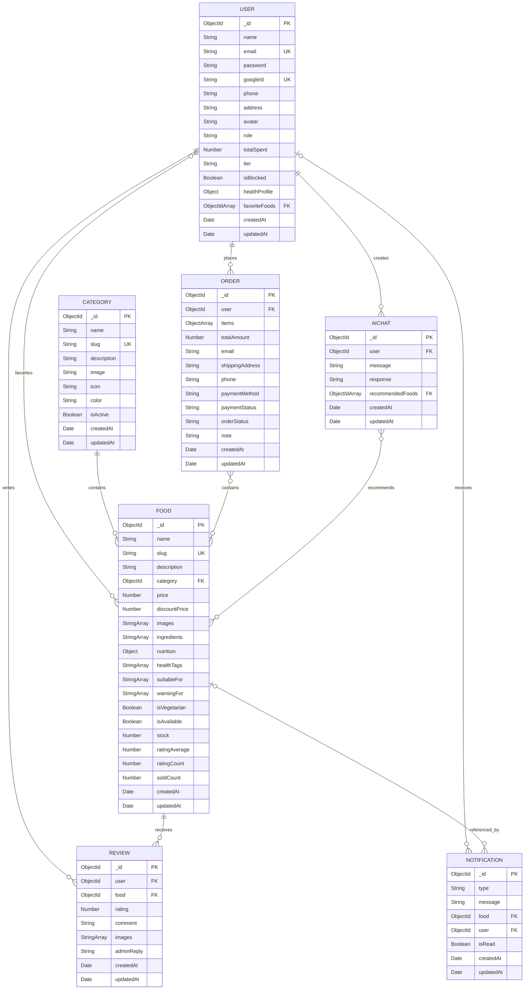

# Tong hop Database de ve ERD

Du an su dung **MongoDB + Mongoose**, gom 7 collection chinh:

1. `users`
2. `categories`
3. `foods`
4. `orders`
5. `reviews`
6. `notifications`
7. `aichats`

> Mongoose tu dong tao `_id: ObjectId` cho moi document va `createdAt`, `updatedAt`
> cho cac schema dang bat `timestamps`.

## 1. Users

| Truong | Kieu | Rang buoc / Ghi chu |
|---|---|---|
| `_id` | ObjectId | PK |
| `name` | String | Bat buoc |
| `email` | String | Bat buoc, unique |
| `password` | String | Bat buoc |
| `googleId` | String | Unique, sparse, tuy chon |
| `phone` | String | Tuy chon |
| `address` | String | Tuy chon |
| `avatar` | String | Co gia tri mac dinh |
| `role` | String | Enum: `user`, `admin`; mac dinh `user` |
| `totalSpent` | Number | Mac dinh `0` |
| `tier` | String | Enum: `Thanh vien`, `Vang`, `Kim Cuong` |
| `isBlocked` | Boolean | Mac dinh `false` |
| `healthProfile` | Object | Document nhung |
| `healthProfile.age` | Number | Tuy chon |
| `healthProfile.gender` | String | Tuy chon |
| `healthProfile.height` | Number | Tuy chon |
| `healthProfile.weight` | Number | Tuy chon |
| `healthProfile.conditions` | String[] | Tuy chon |
| `healthProfile.allergies` | String[] | Tuy chon |
| `healthProfile.goal` | String | Tuy chon |
| `healthProfile.dietType` | String | Tuy chon |
| `healthProfile.activityLevel` | String | Tuy chon |
| `favoriteFoods` | ObjectId[] | FK -> `foods._id` |
| `createdAt` | Date | Tu dong |
| `updatedAt` | Date | Tu dong |

## 2. Categories

| Truong | Kieu | Rang buoc / Ghi chu |
|---|---|---|
| `_id` | ObjectId | PK |
| `name` | String | Bat buoc |
| `slug` | String | Bat buoc, unique |
| `description` | String | Tuy chon |
| `image` | String | Tuy chon |
| `icon` | String | Tuy chon |
| `color` | String | Tuy chon |
| `isActive` | Boolean | Mac dinh `true` |
| `createdAt` | Date | Tu dong |
| `updatedAt` | Date | Tu dong |

## 3. Foods

| Truong | Kieu | Rang buoc / Ghi chu |
|---|---|---|
| `_id` | ObjectId | PK |
| `name` | String | Bat buoc |
| `slug` | String | Bat buoc, unique |
| `description` | String | Bat buoc |
| `category` | ObjectId | Bat buoc, FK -> `categories._id` |
| `price` | Number | Bat buoc |
| `discountPrice` | Number | Tuy chon |
| `images` | String[] | Danh sach anh |
| `ingredients` | String[] | Danh sach nguyen lieu |
| `nutrition` | Object | Document nhung |
| `nutrition.calories` | Number | Tuy chon |
| `nutrition.protein` | Number | Tuy chon |
| `nutrition.carbs` | Number | Tuy chon |
| `nutrition.fat` | Number | Tuy chon |
| `nutrition.sugar` | Number | Tuy chon |
| `nutrition.sodium` | Number | Tuy chon |
| `nutrition.fiber` | Number | Tuy chon |
| `healthTags` | String[] | Tuy chon |
| `suitableFor` | String[] | Tuy chon |
| `warningFor` | String[] | Tuy chon |
| `isVegetarian` | Boolean | Mac dinh `false` |
| `isAvailable` | Boolean | Mac dinh `true` |
| `stock` | Number | Mac dinh `100` |
| `ratingAverage` | Number | Mac dinh `0` |
| `ratingCount` | Number | Mac dinh `0` |
| `soldCount` | Number | Mac dinh `0` |
| `createdAt` | Date | Tu dong |
| `updatedAt` | Date | Tu dong |

## 4. Orders

| Truong | Kieu | Rang buoc / Ghi chu |
|---|---|---|
| `_id` | ObjectId | PK |
| `user` | ObjectId | Bat buoc, FK -> `users._id` |
| `items` | Object[] | Mang document nhung `OrderItem` |
| `items._id` | ObjectId | Mongoose tu dong tao cho subdocument |
| `items.food` | ObjectId | Bat buoc, FK -> `foods._id` |
| `items.name` | String | Bat buoc, snapshot ten mon |
| `items.price` | Number | Bat buoc, snapshot gia |
| `items.quantity` | Number | Bat buoc |
| `items.image` | String | Tuy chon |
| `totalAmount` | Number | Bat buoc |
| `email` | String | Bat buoc |
| `shippingAddress` | String | Bat buoc |
| `phone` | String | Bat buoc |
| `paymentMethod` | String | Enum: `COD`, `BANK`, `MOMO`; mac dinh `COD` |
| `paymentStatus` | String | Enum: `unpaid`, `paid`; mac dinh `unpaid` |
| `orderStatus` | String | Enum: `pending`, `confirmed`, `preparing`, `shipping`, `completed`, `cancelled` |
| `note` | String | Tuy chon |
| `createdAt` | Date | Tu dong |
| `updatedAt` | Date | Tu dong |

## 5. Reviews

| Truong | Kieu | Rang buoc / Ghi chu |
|---|---|---|
| `_id` | ObjectId | PK |
| `user` | ObjectId | Bat buoc, FK -> `users._id` |
| `food` | ObjectId | Bat buoc, FK -> `foods._id` |
| `rating` | Number | Bat buoc, tu `1` den `5` |
| `comment` | String | Mac dinh chuoi rong |
| `images` | String[] | Tuy chon |
| `adminReply` | String | Tuy chon |
| `createdAt` | Date | Tu dong |
| `updatedAt` | Date | Tu dong |

## 6. Notifications

| Truong | Kieu | Rang buoc / Ghi chu |
|---|---|---|
| `_id` | ObjectId | PK |
| `type` | String | Bat buoc, vi du `REVIEW` |
| `message` | String | Bat buoc |
| `food` | ObjectId | Tuy chon, FK -> `foods._id` |
| `user` | ObjectId | Tuy chon, FK -> `users._id` |
| `isRead` | Boolean | Mac dinh `false` |
| `createdAt` | Date | Tu dong |
| `updatedAt` | Date | Tu dong |

## 7. AIChats

| Truong | Kieu | Rang buoc / Ghi chu |
|---|---|---|
| `_id` | ObjectId | PK |
| `user` | ObjectId | Bat buoc, FK -> `users._id` |
| `message` | String | Bat buoc |
| `response` | String | Bat buoc |
| `recommendedFoods` | ObjectId[] | FK -> `foods._id` |
| `createdAt` | Date | Tu dong |
| `updatedAt` | Date | Tu dong |

## Cac moi quan he

| Tu | Quan he | Den | FK |
|---|---|---|---|
| User | 1 - N | Order | `orders.user` |
| User | 1 - N | Review | `reviews.user` |
| User | 1 - N | Notification | `notifications.user` (tuy chon) |
| User | 1 - N | AIChat | `aichats.user` |
| Category | 1 - N | Food | `foods.category` |
| Food | 1 - N | Review | `reviews.food` |
| Food | 1 - N | Notification | `notifications.food` (tuy chon) |
| User | N - N | Food | `users.favoriteFoods[]` |
| Order | N - N | Food | `orders.items[].food` |
| AIChat | N - N | Food | `aichats.recommendedFoods[]` |

## Mermaid ERD

## Luu y khi ve ERD

- `healthProfile`, `nutrition` va `items` dang duoc luu nhung trong document cha,
  khong phai collection rieng.
- Neu ve theo mo hinh quan he chuan, co the tach `OrderItem` thanh bang trung gian
  giua `Order` va `Food`.
- `favoriteFoods` va `recommendedFoods` la mang ObjectId. Neu chuyen sang SQL,
  chung se thanh cac bang trung gian `UserFavoriteFood` va `AIChatRecommendedFood`.
- Schema `Review` hien khong co unique index cho cap `(user, food)`, vi vay mot user
  co the tao nhieu review cho cung mot food neu controller khong chan.
